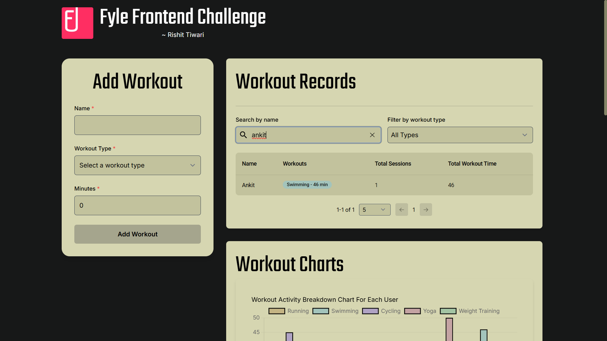
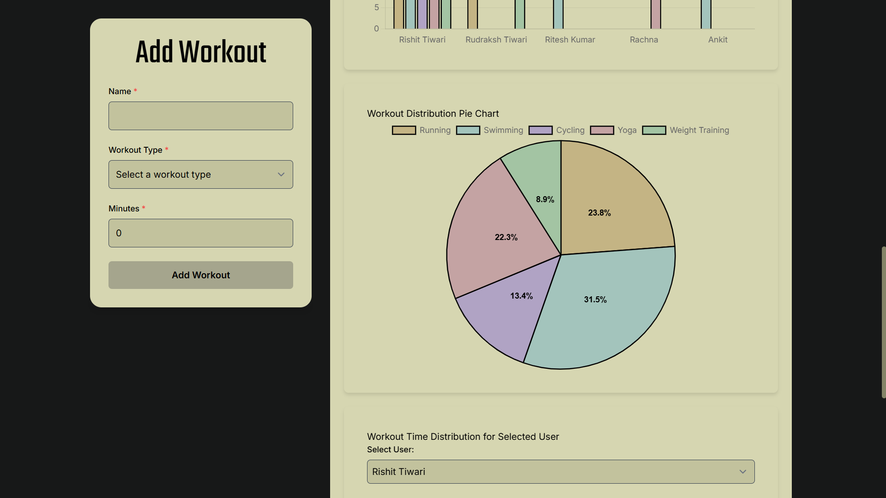

<div align="left">
    
    <div align="left" style="padding-left: 100px">
        <h1 style="font-size: 5rem; margin: 0; padding: 0; color: #666; font-weight: bold; transform: scale(1.1); transform-origin: left">
            Fyle Frontend Challenge
        </h1>
    </div>
</div>

<br clear="both">

A smart workout tracking app built using Angular 14

[]([htt](https://fyle-healthtracker.vercel.app))
[](https://angular.io)
[](https://tailwindcss.com)

##  [Live Demo ↗](https://fyle-healthtracker.vercel.app)

<div align="center">
  
</div>

## 📸 Application Showcase

<table>
  <tr>
    <td width="50%">
      
      <p align="center"><em>Dashboard: Comprehensive overview of your fitness journey</em></p>
    </td>
    <td width="50%">
      
      <p align="center"><em>Workout Entry: Streamlined interface for logging exercises</em></p>
    </td>
  </tr>
  <tr>
    <td width="50%">
      
      <p align="center"><em>Success Confirmation: Instant feedback on workout logging</em></p>
    </td>
    <td width="50%">
      
      <p align="center"><em>Smart Search: Intelligent user search with instant results</em></p>
    </td>
  </tr>
  <tr>
    <td width="50%">
      
      <p align="center"><em>Filter System: Advanced workout categorization</em></p>
    </td>
    <td width="50%">
      
      <p align="center"><em>Empty State: User-friendly feedback when no results found</em></p>
    </td>
  </tr>
  <tr>
    <td width="50%">
      
      <p align="center"><em>Performance Metrics: Detailed workout analytics</em></p>
    </td>
    <td width="50%">
      
      <p align="center"><em>Activity Distribution: Visual breakdown of workout types</em></p>
    </td>
  </tr>
  <tr>
    <td width="50%">
      
      <p align="center"><em>Progress Tracker: Comprehensive fitness journey visualization</em></p>
    </td>
    <td width="50%">
      
      <p align="center"><em>User Metrics: Personalized workout statistics</em></p>
    </td>
  </tr>
</table>

## 🚀 Key Features

- **Elegant UI/UX:** Fully responsive design with smooth and intuitive user interactions.
- **Workout Logging:** Easily log and track your workouts in real-time.
- **User Search:** Quickly find users with an intelligent search feature.
- **Workout Filtering:** Filter workouts efficiently using advanced options.
- **Smart Pagination:** Navigate through data seamlessly with a dynamic pagination system.
- **Local Storage:** Store data persistently for offline access.
- **Real-Time Updates:** Get instant updates for all your workout data.
- **Robust Validation:** Ensure data accuracy with strong validation mechanisms.


## 💻 Technology Stack

- Angular 14+
- TypeScript
- Tailwind CSS
- Angular Material
- Local Storage API
- Karma & Jasmine

## 🛠️ Setup Guide

```bash
# Clone the repository
git clone https://github.com/rixitgithub/fyle_health_tracker.git

# Navigate to project directory
cd fyle_health_tracker

# Install dependencies
npm install

# Launch development server
ng serve
```

Access the application at `http://localhost:4200`

## 📁 Project Architecture

```
src/
├── app/
│   ├── components/
│   │   ├── workout-form/
│   │   ├── workout-list/
│   │   └── workout-charts/
│   ├── services/
│   │   └── workout.service.ts
│   ├── models/
│   │   └── user.model.ts
└── styles/
```

## 🧪 Testing Coverage

```bash
# Execute test suite
ng test

# Generate coverage report
ng test --code-coverage
```

### Coverage Summary
```
=============================== Coverage summary ===============================
Statements   : 100% ( 189/189 )
Branches     : 100% ( 50/50 )
Functions    : 100% ( 66/66 )
Lines        : 100% ( 173/173 )
================================================================================
```

 
 <p align="center"><em>Coverage Report: Achieved 100% Test Coverage Across All Components</em></p>

## ⚠️ Current Limitations

- Local storage-based
- Fixed workout categories
- Single user context

## 🔮 Future Enhancements

- [ ] Backend integration
- [ ] User authentication system
- [ ] Enhanced analytics
- [ ] AI-powered workout suggestions
- [ ] Social sharing capabilities

## 👨‍💻 Developer Profile

**Rishit Tiwari**

[](https://github.com/rixitgithub)
[](https://www.linkedin.com/in/rishit-tiwari/)
[](http://rishit-tiwari.vercel.app/)

## 🙏 Acknowledgments

Grateful to Fyle for providing this opportunity to showcase frontend development expertise.

---

<div align="center">

### Crafted with ❤️ for Fyle

[](mailto:irishittiwari@gmail.com?subject=Issue%20Report)
[](mailto:irishittiwari@gmail.com?subject=Feature%20Request)

</div>
